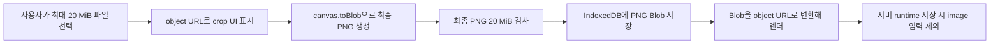

# 12. 사용자 runtime 이미지 브라우저 로컬 저장 계획

상태: 핵심 구현 완료, 실제 브라우저 E2E 미실시 (2026-07-15)

구현 순서 1~4(상수/IndexedDB 서비스, crop Blob 전환, runtime form/shell 통합,
서버 payload 분리·legacy 정리)와 5의 자동 테스트(payload sanitization, legacy
cleanup script)는 완료했다. 실제 브라우저(Playwright 등)로 file 선택·crop·
새로고침·계정 전환·quota 초과를 검증하는 항목은 아직 실행하지 않았다.

## 목적

일반 사용자가 Template Studio 템플릿 실행 화면의 `image` 입력에 등록하고 crop한
최종 PNG를 서버, Supabase DB, R2에 영구 저장하지 않는다. 이 이미지는 편집 중인
브라우저에서만 사용하므로 브라우저 로컬 저장소에 보관한다.

사용자가 처음 선택한 source file도 장기 보존하지 않는다. source file은 crop
화면을 만드는 동안만 메모리에 두고, crop이 끝나면 최종 PNG Blob만 저장한다.

## 적용 범위

이 계획의 대상은 일반 사용자가 아래 경로에서 입력하는 runtime 이미지다.

- 실행 shell: `src/app/(root)/template-studio/_components/runtime/template-studio-runtime-shell.tsx`
- UI: `src/app/(root)/template-studio/_components/runtime/template-studio-runtime-form.tsx`
- crop UI: `src/app/(root)/template-studio/_components/runtime/ui/studio-runtime-image-crop-modal.tsx`
- 사용자 실행 연결: `src/app/(root)/template-studio/_components/template-studio-run-client.tsx`
- runtime 저장 서비스: `src/services/templateStudioRuntimeService.ts`
- runtime 저장 API: `src/app/api/user/templates/[id]/runtime/route.ts`
- 현재 서버 저장 위치: `template_studio_user_states.runtime_values`

다음 이미지는 이번 변경 대상이 아니다.

- 관리자가 Studio 문서 제작 중 동기화하는 canonical template asset
- `template_studio_assets` metadata와 관리자 `assets/sync` API
- Studio preview 임시 asset
- 레거시 timetable/template 이미지 업로드 경로

## 확정 사항

| 항목 | 결정 |
| --- | --- |
| 사용자가 선택할 수 있는 source file | 최대 `20 MiB` (`20,971,520` bytes) |
| 로컬에 저장하는 파일 | crop 완료 후 생성한 최종 PNG Blob |
| crop 결과 최대 크기 | 최대 `20 MiB` (`20,971,520` bytes) |
| source file 보존 | 하지 않음 |
| 추가 이미지 최적화 | 현행 동작을 유지하며 별도 lossy 압축·추가 리사이즈는 하지 않음 |
| 영구 저장소 | IndexedDB |
| `localStorage`/`sessionStorage` | 이미지 binary·Data URL 저장 금지, 필요하면 작은 schema/version 정보만 저장 |
| 서버 저장 | 이미지 binary와 브라우저 로컬 참조를 모두 저장하지 않음 |
| R2·DB migration·업로드 API | 추가하지 않음 |
| 사용 가능 범위 | 동일 origin의 동일 브라우저 profile |

`20 MiB`는 두 지점에서 각각 적용한다.

1. source file이 `20 MiB + 1 byte`이면 decode/crop 전에 거부한다.
2. crop 결과 PNG Blob이 `20 MiB + 1 byte`이면 IndexedDB에 쓰기 전에 거부한다.

source file을 보존하지 않으므로 저장 후 crop 영역을 다시 바꾸려면 사용자가 source
file을 다시 선택해야 한다.

## 왜 `localStorage`에 PNG를 직접 저장하지 않는가

브라우저 내부 저장이라는 방향은 맞지만, 이미지 본문을 `localStorage`에 저장하는
방식은 사용하지 않는다.

- Web Storage는 문자열 key/value만 저장한다.
- `localStorage`는 동기 API라 큰 문자열 직렬화·읽기·쓰기가 main thread를 막는다.
- 일반적인 `localStorage` 한도는 origin당 약 5 MiB다.
- 20 MiB PNG를 base64로 바꾸면 본문만 약 26.7 MiB로 커져 한도를 크게 넘는다.
- 기존 runtime Data URL과 같은 메모리·직렬화 비용 문제가 브라우저 저장소로
  위치만 옮겨질 뿐 해결되지 않는다.

IndexedDB는 비동기로 동작하고 structured clone을 통해 Blob을 그대로 저장할 수
있으므로 이 용도에 더 적합하다. 다만 IndexedDB도 브라우저와 기기의 quota 및
eviction 정책을 따르며 영구 파일 보관소는 아니다.

## 목표 구조



이 흐름에는 이미지 upload API, presigned URL, R2 credential, 신규 Supabase
테이블이 없다. 선택한 source와 crop 결과는 브라우저를 벗어나지 않는다.

## 이미지 처리 정책

### Source file

초기 선택 단계에서 다음 MIME을 허용한다.

- `image/png`
- `image/jpeg`
- `image/webp`
- `image/gif`

SVG는 script/외부 참조 위험 때문에 허용하지 않는다. 브라우저가 decode할 수 없는
파일도 crop 단계에서 거부한다. GIF를 포함한 모든 source는 canvas를 거치므로
최종 저장물은 정적 PNG다. 애니메이션 보존은 이번 범위에 포함하지 않는다.

source 미리보기에는 `URL.createObjectURL(file)`을 사용하고 modal 종료 또는 파일
교체 시 `URL.revokeObjectURL()`로 해제한다. source File 자체는 IndexedDB에
기록하지 않는다.

현재 코드는 crop target이 없는 image input이면 source Data URL을 그대로 runtime에
넣는다. 변경 후에는 이 경우에도 source를 canvas로 decode한 뒤 PNG Blob으로
다시 생성한다. 즉 IndexedDB에는 사용자가 고른 원본 형식이 아니라 화면에서 사용할
최종 정적 PNG만 들어간다.

### Crop 결과

현재 `studio-runtime-image-crop-modal.tsx`의 PNG crop 동작은 유지하되 Data URL
대신 Blob으로 생성한다.

```ts
croppedCanvas.toBlob(callback, "image/png");
```

- `canvas.toDataURL()` 결과를 runtime이나 Web Storage에 저장하지 않는다.
- 최종 PNG Blob은 최대 20 MiB다.
- 별도 JPEG/WebP quality 압축이나 추가 리사이즈를 하지 않는다.
- crop metadata와 source file을 보존하지 않는다.
- 저장 완료 후 재편집하려면 source file을 다시 선택한다.

초기 구현은 현행 crop pixel 크기를 유지한다. 출력 해상도 최적화가 필요하면 실제
템플릿 표시 크기와 export 품질을 측정한 뒤 별도 작업으로 다룬다.

## IndexedDB 설계

신규 서버 테이블 대신 아래 브라우저 DB를 사용한다.

```text
database: temis-template-runtime
version: 1
object store: runtime-images
keyPath: key
index: by-user-template = [userId, templateId]
```

record 예시:

```ts
interface RuntimeImageRecord {
  key: string;
  userId: string;
  templateId: string;
  inputId: string;
  scope: "global" | "day" | "entry";
  contextKey: string;
  blob: Blob;
  mimeType: "image/png";
  byteSize: number;
  createdAt: number;
  updatedAt: number;
  schemaVersion: 1;
}
```

같은 image input도 day/entry마다 다른 값을 가질 수 있으므로 input ID만으로 key를
만들면 안 된다. context key는 다음 규칙을 사용한다.

```text
global scope: global
day scope: day:{dayId}
entry scope: entry:{dayId}:{entryId}

record key: v1:{userId}:{templateId}:{contextKey}:{inputId}
```

entry scope는 배열 index 대신
`runtimeValues.timetable.entriesByDay[dayId][entryIndex].id`의 stable entry ID를
사용한다. entry를 삭제할 때 그 entry ID에 연결된 로컬 image record도 함께
삭제한다.

- 사용자가 보낸 filename을 key로 사용하지 않는다.
- 한 사용자·템플릿·input에는 최신 crop 결과 하나만 둔다.
- 새 Blob의 저장이 성공한 뒤 이전 record를 교체한다.
- user/template/input namespace를 모두 포함해 같은 브라우저에서 계정 간 이미지가
  섞이지 않게 한다.
- native IndexedDB Promise wrapper를 별도 client-only service로 캡슐화한다.
- `window`/`indexedDB` 접근은 Client Component 또는 browser-only service에서만
  수행해 SSR 시 실행되지 않게 한다.

client가 계정 namespace를 만들 수 있도록 runtime GET 응답에는 인증 결과에서 만든
`storageOwnerId`를 포함한다. 이는 현재 로그인한 사용자 자신의 안정적인 식별자이며
secret이 아니다. request body나 query로 받은 사용자 ID는 사용하지 않는다. 계정이
바뀌면 React Query cache와 runtime shell key도 `storageOwnerId` 기준으로 분리한다.

권장 service 경로:

```text
src/services/browser/templateStudioRuntimeImageStorage.ts
```

최소 인터페이스:

```ts
putRuntimeImage(record): Promise<void>
getRuntimeImage(locator): Promise<RuntimeImageRecord | null>
deleteRuntimeImage(locator): Promise<void>
deleteRuntimeImagesForTemplate(userId, templateId): Promise<void>
```

## 서버 runtime 상태와의 분리

IndexedDB key는 해당 브라우저 origin에서만 의미가 있으므로
`template_studio_user_states.runtime_values`에 저장하지 않는다. `browser-asset://...`
같은 로컬 참조 문자열도 서버에 보내지 않는다.

runtime load/save 경계는 다음과 같이 변경한다. 서버 쪽에는 document를 기준으로
global/day/entry의 모든 image input key를 제거하는
`stripStudioRuntimeImageValues()` 같은 공통 helper를 둔다.

1. 서버 runtime GET으로 text/select/timetable 등 동기화 가능한 값만 읽는다.
2. 화면 hydration 후 현재 사용자·template의 image Blob을 IndexedDB에서 읽는다.
3. Blob은 `URL.createObjectURL()`로 변환해 해당 image input의 화면 상태에 합성한다.
4. runtime GET의 신규 기본값·revision reconciliation 자동 저장에도 image key를
   제거해 document의 `defaultUrl`이 사용자 상태에 복제되지 않게 한다.
5. runtime PUT 전 client와 server 양쪽에서 document의 `image` input 값을 제거한다.
6. image가 없는 서버 runtime 응답은 오류가 아니라 정상 상태로 처리한다.

`getStudioRuntimeInputValue()`는 runtime 값이 없을 때 document의 image `defaultUrl`을
사용하므로 canonical 기본 이미지는 계속 표시할 수 있다. 제거 대상은 사용자별
runtime image 값이지 document 자체의 기본 asset이 아니다.

object URL은 저장값이 아니며 새로고침 때마다 Blob에서 다시 만든다. 이미지 교체,
component unmount, template 전환 시 이전 URL을 반드시 revoke한다.

crop 적용은 해당 이미지의 로컬 저장 동작으로 간주한다. IndexedDB transaction이
성공한 뒤에만 새 object URL을 runtime 화면에 반영하고, 실패하면 기존 이미지와
record를 유지한다. 기존 "저장" 버튼은 text/select/timetable 등 서버 동기화 값만
저장한다는 점을 UI에 명시한다. "초기화"는 서버 저장값과 현재 IndexedDB 이미지를
다시 합성하고, 이미지 삭제 action만 해당 로컬 record를 실제로 삭제한다.

이 결정의 결과는 명확하다.

- 같은 브라우저에서 새로고침하면 복원할 수 있다.
- 다른 브라우저·기기에서는 복원할 수 없다.
- 사용자가 사이트 데이터/IndexedDB를 지우면 복구할 수 없다.
- 시크릿 모드에서는 창을 닫을 때 사라질 수 있다.
- 현재 PNG export는 `template-studio-runtime-shell.tsx`에서 브라우저의
  `html-to-image.toPng()`로 실행하므로 object URL 이미지를 함께 capture할 수 있다.
- 향후 server-side render/export를 추가하면 브라우저 Blob에는 접근할 수 없으므로
  사용자 이미지를 포함하지 않거나 별도 업로드 정책을 다시 결정해야 한다.

## quota와 데이터 유실 처리

20 MiB 제한은 개별 파일의 애플리케이션 제한일 뿐, 저장 성공을 보장하는 browser
quota가 아니다.

- 쓰기 전 `navigator.storage.estimate()`로 현재 usage/quota를 확인하고 여유가
  명백히 부족하면 일찍 안내한다.
- 실제 IndexedDB write는 `try/catch`로 감싸 `QuotaExceededError`를 처리한다.
- quota 추정값은 정확한 예약이 아니므로 최종 판단은 write 결과로 한다.
- 저장 실패 시 기존 성공 record를 먼저 지우지 않는다.
- 화면에는 "이 이미지는 이 브라우저에만 저장되며 사이트 데이터 삭제 시
  사라집니다"를 표시한다.
- persistent storage 요청(`navigator.storage.persist()`)은 브라우저가 거부할 수
  있으므로 데이터 보존 보장으로 표현하지 않는다. 필요성은 실제 eviction 사례를
  확인한 뒤 결정한다.

## 계정 전환과 로컬 개인정보

IndexedDB의 same-origin 격리는 다른 사이트 접근을 막지만, 애플리케이션 사용자별
암호화나 운영체제 사용자별 보안을 제공하는 것은 아니다.

- record 조회에는 현재 인증 사용자의 `userId`를 반드시 포함한다.
- 로그아웃 즉시 메모리의 object URL과 image UI 상태를 비운다.
- 다른 계정으로 로그인했을 때 이전 계정 record를 자동 표시하지 않는다.
- 사용자가 직접 지울 수 있는 "이 브라우저의 편집 이미지 삭제" 기능을 제공한다.
- 로그아웃 시 IndexedDB record까지 자동 삭제할지는 UX 정책으로 분리한다. 기본은
  재로그인 복원을 위해 보존하되 계정 namespace로 격리한다.
- XSS가 발생하면 같은 origin의 IndexedDB도 읽힐 수 있으므로 민감 정보의 영구
  보관 수단으로 안내하지 않는다.

## 기존 Data URL 정리

현재 서버 runtime에 저장된 image Data URL은 보존 대상이 아니다. R2나 IndexedDB로
이전하지 않고 제거하며, 사용자가 이미지를 다시 선택하도록 한다.

1. runtime GET reconciliation에서 모든 scope의 legacy image 값을 제거한다.
2. 기존 state가 변경됐다면 정리된 runtime 값을 같은 요청에서 다시 저장한다.
3. runtime PUT에서도 image key를 제거해 구버전·변조 client의 재유입을 막는다.
4. 아직 사용자가 열지 않은 state는 read-only 현황을 확인한 뒤 별도 cleanup
   script로 image key만 제거할 수 있게 한다.
5. cleanup은 text/select/timetable 값과 document의 canonical `defaultUrl`을 건드리지
   않는다.

이 정리는 신규 table이나 schema migration을 필요로 하지 않는다. 운영 DB cleanup은
전체 개발과 로컬 복제 DB 검증이 끝난 뒤 사용자가 별도로 실행한다.

## API 요청 제한

이미지를 브라우저에만 저장하더라도 구버전 또는 악의적인 client가 API에 큰 Data
URL을 보낼 수 있다. 따라서 server runtime API의 원본 request 제한은 별도로
유지한다.

- `Content-Length`가 허용된 runtime request 크기를 넘으면 JSON parse 전에 `413`으로
  거부한다.
- `Content-Length`가 없거나 실제 body가 더 큰 경우를 막기 위해 `request.json()`이나
  `request.text()`로 전체를 먼저 읽지 않는다. `request.body.getReader()`로 chunk를
  읽으면서 누적 byte가 상한을 넘는 즉시 stream을 취소하고 `413`으로 응답한다.
- 상한 안에서 모두 읽은 byte만 `TextDecoder`와 `JSON.parse()`로 변환한다.
- 정상 payload에서도 image key는 server helper로 제거한다.
- 안정화 이후에는 non-empty image runtime 값을 `400`으로 거부해 오래된 client를
  드러내는 방식을 검토한다.
- browser source/crop의 20 MiB 한도는 API body 한도를 늘리는 근거가 아니다. PNG
  Blob은 API request에 포함되지 않는다.

## 구현 순서

### 1. 상수와 browser storage service

- source/crop 결과의 `20 MiB` 상수 분리
- IndexedDB open/upgrade/transaction Promise wrapper 추가
- put/get/delete와 사용자·template namespace 처리
- global/day/stable entry ID context key 처리
- runtime GET의 인증 결과에서 `storageOwnerId`를 제공하고 cache/shell key에 반영
- `QuotaExceededError`를 UI에서 구분할 수 있는 오류로 정규화

### 2. crop 결과를 Blob으로 변경

- `FileReader.readAsDataURL()` 의존 제거
- source preview는 object URL 사용
- crop 결과는 `toBlob("image/png")` 사용
- crop target이 없는 image input도 canvas를 거쳐 최종 PNG Blob으로 변환
- source와 crop 결과를 각각 20 MiB로 검사
- 모든 object URL 해제 경로 구현

### 3. runtime form 통합

- 인증 사용자·template·input key로 IndexedDB 읽기/쓰기
- 새로고침 후 로컬 Blob 복원
- image 삭제·교체 시 record와 object URL 정리
- entry 삭제 시 stable entry ID에 연결된 record 정리
- crop 적용 즉시 local save, 초기화 시 local image 재합성 동작 구현
- loading/error/quota/로컬 전용 안내 UI 추가

### 4. 서버 payload 분리와 legacy 전환

- GET reconciliation·응답·자동 저장과 PUT에서 모든 scope의 image input 제거
- runtime GET 결과와 로컬 image 값을 client에서 scope/context별로 합성
- Data URL과 로컬 key가 API request body에 포함되지 않는지 검사
- 기존 Data URL을 보존하지 않고 lazy cleanup 및 명시적 cleanup script로 제거
- JSON parse 전 runtime API 원본 request byte 제한 추가

### 5. 테스트

- browser storage service unit/integration 테스트
- runtime payload sanitization 테스트
- 실제 브라우저의 file 선택·crop·새로고침·계정 전환 E2E
- quota와 site-data 삭제 시 오류/빈 상태 E2E

DB migration, R2 설정, upload/download API 구현은 이 계획에 포함하지 않는다.

## 테스트 시나리오

### 크기·형식

- [ ] source file `20 MiB`가 crop 단계에 진입한다.
- [ ] source file `20 MiB + 1 byte`가 decode/crop 전에 거부된다.
- [ ] crop PNG `20 MiB`가 IndexedDB에 저장된다(브라우저 quota가 충분한 경우).
- [ ] crop PNG `20 MiB + 1 byte`가 IndexedDB write 전에 거부된다.
- [ ] PNG/JPEG/WebP/GIF source가 정적 PNG crop 결과를 만든다.
- [ ] SVG와 decode 불가능 파일이 거부된다.
- [ ] crop target이 없는 source도 최종 정적 PNG Blob으로 변환된다.
- [ ] source file과 crop metadata가 IndexedDB에 남지 않는다.

### 저장·복원

- [ ] IndexedDB에는 PNG Blob이 저장되고 localStorage/sessionStorage에는 image
      Data URL 또는 binary 문자열이 없다.
- [ ] 같은 사용자·브라우저에서 새로고침 후 이미지가 복원된다.
- [ ] global/day/entry image가 각 context에 맞게 독립적으로 복원된다.
- [ ] entry 순서가 바뀌어도 stable entry ID 기준으로 올바른 이미지가 복원된다.
- [ ] entry 삭제 후 연결된 로컬 image record가 제거된다.
- [ ] 이미지 교체 후 이전 record와 object URL이 정리된다.
- [ ] image 삭제 후 새로고침해도 다시 나타나지 않는다.
- [ ] 사이트 데이터를 지운 뒤 빈 image 상태와 안내가 정상 표시된다.
- [ ] quota 부족 시 기존 이미지가 유지되고 저장 실패 안내가 표시된다.

### 격리·서버 경계

- [ ] 사용자 A의 record가 사용자 B 화면에 나타나지 않는다.
- [ ] 같은 template 화면에서 계정을 전환해도 이전 계정의 query cache와 object URL이
      재사용되지 않는다.
- [ ] template A의 record가 template B 화면에 나타나지 않는다.
- [ ] 로그아웃 시 메모리 image 상태와 object URL이 제거된다.
- [ ] runtime PUT body에 image Data URL, Blob, IndexedDB key가 포함되지 않는다.
- [x] GET reconciliation 자동 저장과 PUT 결과 DB runtime에 어느 scope의 image key도
      남지 않는다. (`check:runtime-image-strip`)
- [x] oversized runtime request가 JSON parse 전에 `413`으로 거부된다.
      (`check:runtime-payload-limits`)
- [ ] 이미지 선택·crop·복원 과정에서 R2/Supabase image upload 요청이 발생하지 않는다.
- [ ] 서버 runtime GET에 image 값이 없어도 화면이 로컬 Blob을 정상 합성한다.
- [ ] 현재 browser PNG export가 object URL image를 포함한다.
- [ ] 초기화 후 현재 계정의 IndexedDB 이미지가 다시 표시되고, 명시적 이미지 삭제
      후에는 새로고침해도 표시되지 않는다.

### legacy 정리

- [x] legacy Data URL은 IndexedDB/R2로 이전하지 않고 server runtime에서 제거된다.
      (`check:runtime-image-strip`)
- [x] global/day/entry의 image key만 제거되고 다른 runtime 값은 유지된다.
      (`check:runtime-image-strip`)
- [x] cleanup script가 dry-run으로 대상 row와 예상 제거 건수를 먼저 보여준다.
      (`scripts/cleanup-legacy-runtime-image-data.ts`, `check:runtime-image-strip`)
- [x] cleanup 실패가 원본 row를 부분 JSON 상태로 남기지 않는다. (row당 단일
      `update()`로 원자적으로 교체 — 강제 실패 시나리오는 별도로 재현하지 않음)

## 완료 기준

- [ ] source와 crop 결과에 각각 20 MiB 제한이 적용된다. (코드 구현 완료, 실제
      브라우저 검증 아직)
- [ ] source는 메모리에만 존재하고 최종 PNG Blob만 IndexedDB에 저장된다. (코드
      구현 완료, 실제 브라우저 검증 아직)
- [x] image Data URL·Blob·로컬 key가 DB 또는 API payload에 저장되지 않는다.
      (`check:runtime-payload-limits`, `check:runtime-image-strip`)
- [x] R2 credential, 신규 R2 object, 신규 DB table/migration이 생기지 않는다.
- [ ] 같은 브라우저 새로고침 복원과 사용자·template 격리가 동작한다. (코드 구현
      완료, 실제 브라우저 검증 아직)
- [ ] quota 초과·site data 삭제·계정 전환이 안전하게 처리된다. (코드 구현 완료,
      실제 브라우저 검증 아직)
- [x] 기존 Data URL은 다른 runtime 값을 보존하면서 제거된다.
      (`check:runtime-image-strip`)
- [ ] 타입 검사, ESLint, production build, 실제 브라우저 E2E가 통과한다.
      (타입 검사·ESLint 통과, production build·실제 브라우저 E2E는 미실시)
- [x] 브라우저 로컬 전용이라는 데이터 수명 제한이 UI와 문서에 명시된다.
      (`imageLocalOnlyNotice` 안내 문구를 runtime 이미지 업로드 UI에 노출)

## 참고 자료

- [MDN: IndexedDB API](https://developer.mozilla.org/en-US/docs/Web/API/IndexedDB_API)
- [MDN: Storage quotas and eviction criteria](https://developer.mozilla.org/en-US/docs/Web/API/Storage_API/Storage_quotas_and_eviction_criteria)
- [MDN: HTMLCanvasElement.toBlob()](https://developer.mozilla.org/en-US/docs/Web/API/HTMLCanvasElement/toBlob)
