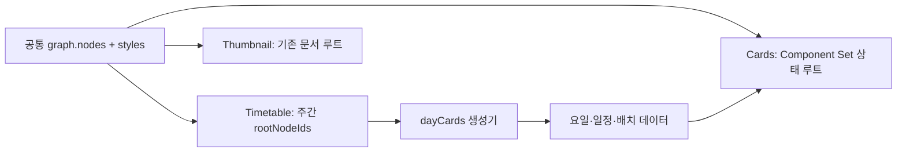

# 시간표 객체 저장 모델 통합 설계 — 3b

작성일: 2026-10-04. 1~3a단계 이후의 설계와 신규 모델 구현 기록이다.

**사용자 확인:** 현재 DB에 있는 Studio 템플릿 두 개는 모두 테스트 데이터이며 보존·레거시 지원 대상에서 제외한다. 따라서 기존 문서 변환, ID 보존, v7/v8 병행 출시, 원격 템플릿 왕복을 선행 조건으로 두지 않는다. 이 사실은 사용자 설명에 근거하며 원격 DB를 조회한 결과가 아니다. 기존 데이터 삭제나 원격 DB 변경 요청은 없었다.

신규 시간표 에디터의 생성·편집 상태·이력·저장·JSON과 화면 조회·렌더 경계를 v8에 연결했다. 기존 에디터 화면을 유지하며 graph/styles/nodeExtensions를 직접 읽고 수정한다. 문서 전체를 변환하던 쓰기·읽기 어댑터는 제거했다. 프리셋 생성까지 신규 그래프로 단일화했으며 최신 결과는 14절에 기록한다. Thumbnail은 기존 v7 경로를 유지한다.

## 1. 결정

**기존 `document.graph.nodes`와 `document.styles`를 공통 객체 저장소로 사용한다.** 시간표 composition의 객체를 이 저장소로 옮기고, 시간표 도메인은 주간 화면의 루트와 반복·역할·일정 정보를 갖는다.

Cards와 Timetable은 서로 다른 문서가 아니라 같은 문서의 서로 다른 편집 화면이다. 저장소를 합쳐도 카드 디자인과 전체 시간표의 좌표계·루트·사용자 값은 별도로 해석한다. Thumbnail의 기존 그래프 문서도 같은 코어를 계속 사용한다.

| 검토한 방향                                      | 판단                                                                                                          |
| ------------------------------------------------ | ------------------------------------------------------------------------------------------------------------- |
| 타입과 함수만 공유하고 두 저장소를 계속 유지     | 3a단계에서 이미 얻은 효과다. 복제·삭제·참조 검증의 이중 경로는 남는다.                                        |
| 새 `document.objects`와 inline style로 전면 교체 | Cards, Thumbnail, 스타일 전파, 클립보드, Figma 등 기존 경로를 함께 바꿔야 한다. 이번 목적에 비해 범위가 크다. |
| 기존 graph/style 저장소를 확장                   | **채택.** 기존 기본 요소·스타일 참조를 유지하면서 시간표 객체의 저장 경로를 통합할 수 있다.                   |

`styleId`는 CSS 클래스나 공유 디자인 토큰이 아니다. 객체가 사용할 스타일 레코드의 참조다. 이전 시간표 객체에는 개별 styleId를 배정하며, 값이 같다는 이유로 서로 다른 객체의 스타일을 합치지 않는다. 기존 그래프에서 실제로 공유하던 styleId 관계는 보존한다.

## 2. 코드에서 확인한 제약

| 근거                                                                                                                                                                                                       | 설계에 미치는 영향                                                                   |
| ---------------------------------------------------------------------------------------------------------------------------------------------------------------------------------------------------------- | ------------------------------------------------------------------------------------ |
| [타입](../src/types/template-studio.ts): 그래프 기본 종류 5개, composition 기본/전용 종류, 두 canvas                                                                                                       | `kind` 이름만 바꿔서 합칠 수 없다. 생성 카드와 레거시 종류를 따로 해석해야 한다.     |
| [Component Set](../src/utils/template-studio/component-sets.ts): 모든 상태 루트를 graph 루트에 등록                                                                                                        | graph 루트 전체를 화면 루트로 사용하면 다른 상태 디자인과 주간 객체가 함께 그려진다. |
| [geometry](../src/utils/template-studio/object-layout.ts): 루트의 Fill parent는 전달된 canvas에 의존                                                                                                       | 전체 시간표 크기와 카드 편집 canvas를 혼용하면 Board·프로필 크기가 바뀐다.           |
| [공통 렌더러](../src/components/studio/canvas/studio-renderer.tsx), [시간표 렌더러](<../src/app/(root)/template-studio/_components/studio-timetable-preview.tsx>): 서로 다른 이미지·빈 값·기본 스타일 정책 | 저장 변환과 렌더 동작 변경을 분리해야 한다.                                          |
| [상태 해석](../src/utils/template-studio/timetable-composition.ts): 자식 배열과 선택한 상태 루트, `hidden`을 함께 해석                                                                                     | On/Off를 단순 표시 boolean으로 바꾸면 Off 디자인이 사라진다.                         |
| [반복 배치](../src/utils/template-studio/timetable-placement.ts): Grid 보정 좌표와 Custom 절대 좌표                                                                                                        | 생성 카드의 위치를 일반 노드의 left/top에 복제하면 값의 소유자가 둘이 된다.          |
| [클립보드](../src/utils/template-studio/node-clipboard.ts): childIds만 재귀 복제하고 새 ID 부여                                                                                                            | variant 루트 참조와 도메인 확장 참조를 함께 재작성해야 한다.                         |
| [crop 대상](../src/utils/template-studio/runtime-image-crop.ts): composition과 profileRole 검색                                                                                                            | 저장소 이동 후 사용자 이미지 편집도 새 역할 인덱스를 읽어야 한다.                    |
| [검증기](../src/utils/template-studio/validator.ts): graph와 composition 각각의 트리·입력 검증                                                                                                             | 도달성은 모든 상태 자식을 검사하고, 화면별 렌더 도달성과 구분해야 한다.              |

현재 sample-document는 문서 v7, 그래프 16개/루트 2개/스타일 16개, composition 1개/루트 1개다. composition 객체는 생성 카드 영역뿐이다. **이 샘플만으로 Artist·Memo·Profile·Top Object의 변환이 안전하다고 판단할 수 없다.** 현재 프리셋의 신규 생성과 참조 무결성 fixture로 검증한다. 기존 DB 템플릿을 fixture로 확보할 필요는 없다.

## 3. 목표 저장 계약

다음 이름과 타입은 설계안이다. 구현 시 기존 `StudioGraphNode`를 점진적으로 확장하며 새 범용 프레임워크를 만들지 않는다.

```ts
// 공통 객체: 두 편집 화면 모두 여기의 한 레코드를 수정한다.
interface StudioObjectCore {
  id: string;
  type: "group" | "text" | "flexibleText" | "image" | "shape";
  label: string;
  parentId: string | null;
  childIds: string[];
  styleId?: string;
  layoutMode?: "fixed" | "fillParent";
  binding?: StudioBinding;
  assetSlots?: Record<string, StudioAssetSlot>;
  fit?: StudioImageFit;
  hidden?: boolean;
  locked?: boolean;
  variantSet?: StudioObjectVariantSet;
  textAppearance?: StudioTextAppearance;
  shapeFill?: StudioShapeFill;
  meta?: StudioGraphNodeMeta;
}

// 구조화된 그룹의 대체 디자인. 일정의 Online/Offline 모델은 포함하지 않는다.
interface StudioObjectVariantSet {
  options: Array<{ value: string; label: string }>;
  defaultValue: string;
  mode?: "toggle" | "always";
  inputId?: string | null;
  rootByValue: Record<string, string | null>;
}

interface StudioTimetableNodeExtension {
  presetId?: StudioTimetableObjectPresetId;
  profileRole?: StudioTimetableProfileObjectRole;
  structuredRole?: StudioTimetableStructuredObjectRole;
  generator?: { kind: "dayCards" };
  inlineAssetLayout?: {
    mode?: "visible" | "hidden";
    position?: "left" | "right";
    gap?: number;
    size?: number;
  };
}

// timetable의 기존 week/days/components/statuses/canvas 등은 계속 유지한다.
// composition.objects와 rootObjectIds는 아래 참조와 확장 인덱스로 대체한다.
interface StudioTimetableObjectReferences {
  rootNodeIds: string[]; // 주간 화면의 최상위 객체, 뒤→앞 순서
  nodeExtensions: Record<string, StudioTimetableNodeExtension>;
}
```

원칙은 다음과 같다.

- `graph.nodes`에 객체를 한 번만 저장한다. `composition.objects`를 동기화용 사본으로 계속 쓰지 않는다.
- `graph.rootNodeIds`는 전체 저장 forest의 루트 목록이다. 기존 카드 상태 루트와 새 시간표 루트를 포함한다. `timetable.rootNodeIds`는 주간 화면의 루트 부분집합과 그 화면의 그리기 순서를 지정한다.
- 도메인 인덱스는 생성기·프리셋 역할만 갖는다. 스타일·바인딩·hidden 값을 복제하지 않는다. 데이터 연결은 같은 `StudioBinding`을 사용한다.
- 공통 객체의 `variantSet`은 객체의 대체 디자인 구조다. 일정 상태와 Component Set의 `variants[statusId]`는 시간표 도메인에 남긴다. 두 상태 모델을 하나의 옵션 목록으로 합치지 않는다.
- `activeValue`, 선택/접힘/줌, 현재 편집 화면은 에디터 view에 남긴다. 런타임 값, 문서, Undo 문서 스냅샷에 추가하지 않는다.
- 레거시·알 수 없는 메타데이터는 임의로 삭제하지 않는다. 기존 exception의 구조 보호 계약도 보존한다. `presetId`·역할 등 이동 대상은 새 확장 인덱스만 작성하며, 이동한 top-level 역할 필드는 제거한다. `meta.exception.presetId` 등 기존 구조 계약의 식별자는 계약과 함께 보존한다.



## 4. 화면과 반복 영역의 경계

렌더링·geometry·추가·붙여넣기 명령에는 편집 화면의 문맥을 전달한다.

```ts
type StudioSurfaceContext =
  | { kind: "cards"; componentId: string; statusId: string }
  | { kind: "timetable" }
  | { kind: "thumbnail" };
```

각 화면의 어댑터가 루트, canvas, 입력 scope, 공통 프레임 정책을 결정한다. 공통 객체 명령이 전역 `document.canvas`나 모든 graph 루트를 곧바로 사용하면 안 된다.

| 대상                | 저장되는 것                                                               | 계산되는 것                     |
| ------------------- | ------------------------------------------------------------------------- | ------------------------------- |
| Cards               | 상태별 디자인 루트, Component Set frame                                   | 선택한 상태의 렌더 루트·프레임  |
| 전체 시간표         | 주간 루트, timetable canvas                                               | 주간 렌더 루트와 좌표계         |
| Day Card Containers | `group` 노드 + generator 확장, opacity/rotate 스타일, 기존 dayCardsLayout | 전체 반복 영역의 bounds         |
| 요일 인스턴스       | days의 Component Set 지정, layout의 요일별 보정                           | 해당 날짜의 카드·상태·위치·크기 |

생성 카드 영역의 left/top/width/height는 계속 `dayCardsLayout`과 실제 카드 크기에서 계산한다. 생성기 노드의 style에 같은 값을 다시 저장하지 않는다. 일반 Fit/Resize 명령이 이 노드에 적용되지 않게 도메인 capability로 제한한다.

요일 7개를 영구 자식 노드로 만들지 않는다. `day-card:<dayId>`는 가상 인스턴스로 유지하며, 선택은 문자열만 해석하지 않고 `{ kind: "dayInstance", generatorNodeId, dayId }`처럼 구분한다. 실제 노드 ID가 `day-card:mon`일 때도 인스턴스로 오인하지 않아야 한다.

`mountNodeId`는 현재 카드 frame/붙여넣기 경로에서 사용하는 기존 참조를 보존한다. 이를 주간 루트로 재활용하지 않는다. 필요한 제거는 별도 단계에서 호출 경로를 없앤 뒤 진행한다.

## 5. 이미지와 렌더 호환 계약

저장 모델 통합만으로 두 렌더러를 동일 JSX로 바꾸지 않는다. 첫 구현은 저장소 어댑터를 교체하되 기존 시간표 렌더 정책을 유지한다. 공통 renderer에는 명시적인 surface/domain 해석을 연결하고, 기능별 출력 동등성을 증명한 뒤 시간표 분기를 줄인다.

| 현재 저장                                                  | 목표 매핑                                                              | 보존할 동작                                                           |
| ---------------------------------------------------------- | ---------------------------------------------------------------------- | --------------------------------------------------------------------- |
| 그래프 이미지 `binding` + `fit`                            | 그대로 유지                                                            | 기존 이미지/crop/focus 동작                                           |
| 그래프 `assetSlots.asset`                                  | 그대로 유지                                                            | **배경 슬롯**이다. 시간표의 전경 asset과 같은 의미로 처리하지 않는다. |
| 시간표 이미지 `assetSlots.asset`                           | 이미지 `binding` + `fit`                                               | 기본 contain, profile 사용자 이미지의 authoring/runtime 구분          |
| 시간표 `assetSlots.background`                             | 그래프 배경 `assetSlots.asset`                                         | 기존 배경 fit과 입력 우선순위                                         |
| 입력 배경 + `backgroundAssetId` fallback                   | 배경 슬롯에 선택적 `fallbackAssetId` 추가                              | 입력이 비면 정적 fallback, 값이 있으면 입력 이미지를 사용             |
| Artist 텍스트의 장식 asset + `assetMode/Position/Gap/Size` | `assetSlots.inlineDecoration` + `nodeExtensions[id].inlineAssetLayout` | 텍스트 옆 이미지의 방향·간격·크기; 일반 이미지 배경으로 오인하지 않음 |

배경 `fallbackAssetId`는 기존 slot의 `assetId`와 구분한다. inputId와 assetId가 함께 있던 slot의 assetId를 자동으로 fallback이라고 해석하지 않는다. fallback 필드를 명시한 슬롯만 resolver가 입력 미해석 시 이 자산을 사용한다. fit은 현재처럼 input slot의 fit을 우선하고 레거시 backgroundFit은 그 값이 없을 때 적용한다. fallback이 없는 기존 Cards/Thumbnail 슬롯의 동작은 바꾸지 않는다.

Artist의 장식 슬롯은 이미지 바인딩과 다른 위치에 두므로 텍스트 binding을 유지한다. 이동한 4개 style 필드는 삭제하고 확장 인덱스만 수정한다. 누락된 size는 현재 렌더러의 `min(160, geometry.height || 160)` 및 최소 24 계산을 유지하며, gap은 기본 32/최소 0이다. 변환 시 임의의 고정 size를 채우지 않는다.

이 매핑의 실제 동등성은 fallback·inline 장식 fixture로 검증한다. 미지원 값이나 충돌한 슬롯 키는 실패/진단으로 반환해야 하며 일반 배경으로 자동 변환하지 않는다. 알 수 없는 `assetSlots` 키도 조용히 버리거나 덮어쓰지 않는다.

기존 시간표의 기본값/호환 정책: percent opacity, 기존 transform 처리, 텍스트 빈 값의 label/placeholder, localized preset default text, Auto Text 줄 높이, 기본 image fit, profile dummy 이미지의 런타임 비표시. 이것들은 graph에 옮긴 뒤 기본 Cards 정책으로 렌더하면 달라질 수 있다. 첫 전환에서는 시간표 surface 어댑터가 기존 함수를 사용한다.

Off 루트의 `hidden`도 그대로 보존한다. 옵션에서 Off를 골랐다는 이유만으로 hidden을 제거하지 않는다. 표시가 필요한 Off 디자인은 현재처럼 별도 디자인과 visible 설정을 가진다.

## 6. 신규 문서 생성 규칙과 불변식

기존 데이터를 변환하지 않는다. 새 `StudioTimetableGraphDocument`는 v8이며 기본 카드 디자인 레시피와 공통 graph/style 저장소로 생성한다. 기존 v1~v7 JSON은 새 parser가 거부한다. 기존 문서와의 ID 대응표나 무손실 역변환을 구현하지 않는다.

프리셋 추가는 원본 문서를 바꾸지 않고 새 문서를 반환한다. 프리셋 레시피의 모든 신규 node/style ID를 먼저 확보하고 parent/child 및 variant 루트를 같은 계획으로 연결한다. 기존 입력 생성 레시피는 재사용한다. 레시피의 임시 inline style은 결과 graph에 저장하지 않는다.

필수 불변식:

- 객체는 graph.nodes, 스타일은 document.styles, 역할은 nodeExtensions에만 저장한다. style/kind 등 composition 필드를 graph 노드에 넣은 JSON은 거부한다.
- 모든 parent/child가 상호 일치하고 순환·다중 부모·도달 불가능한 노드가 없다. 주간 roots는 전체 roots의 부분집합이며 카드 상태 디자인과 겹치지 않는다.
- variant 루트는 소유자의 자식이며 모든 상태 자식은 저장 트리에 존재한다. activeValue는 저장하지 않는다.
- 생성기 group에 요일 자식을 영구 저장하지 않는다. 반복 bounds/요일 위치는 기존 timetable 배치 데이터에서 계산한다.
- foreground 이미지는 binding + fit, background는 assetSlots.asset, inline 장식은 inlineDecoration + 역할 확장으로 구분한다.
- 날짜 포맷은 binding, inline 장식의 배치는 확장 인덱스에 저장한다. style에 중복 저장하면 검증에서 거부한다.
- 프리셋 추가·조회용 projection·실제 렌더링은 원본 문서를 변경하지 않는다. projection은 저장/Undo에 들어가지 않는다.
- 새 JSON의 내보내기·읽기에서 구조와 실제 렌더 결과를 유지한다. 미지원 shape/구조화된 텍스트 효과는 시간표 projection에서 진단하며 조용히 다른 요소로 그리지 않는다.

## 7. 변경해야 할 경로

| 경로                                                                             | 구현 사항                                                                                  |
| -------------------------------------------------------------------------------- | ------------------------------------------------------------------------------------------ |
| `types/template-studio.ts`, `migrations.ts`, `validator.ts`                      | 공통 variant/도메인 확장 타입, 새 모델 검증, v8 신규 생성 경로                             |
| `timetable-composition.ts`, `timetable-preset-commands.ts`, `preset-registry.ts` | 프리셋을 graph/style + 역할 참조 생성 레시피로 변경                                        |
| `timetable-selection.ts`, 인스펙터/레이어, `template-studio-client.tsx`          | 실제 노드와 가상 인스턴스 구분, surface별 기능·선택                                        |
| `node-style-commands.ts`, `graph-commands.ts`, timetable 명령                    | 공통 객체 명령 + 생성기/프레임 제한; 화면 문맥 전달                                        |
| `studio-renderer.tsx`, `studio-timetable-preview.tsx`, `object-layout.ts`        | 명시적 roots/canvas, 시간표 호환 렌더 어댑터, 상태 자식 해석                               |
| `node-clipboard.ts`, Component Set 복제, 삭제, 스타일 전파                       | 노드·style·variant·도메인 확장 참조를 한 계획으로 복제/재작성; 공유 style 삭제는 참조 확인 |
| `runtime-image-crop.ts`, 이미지 슬롯/입력 consumers, font consumers              | composition 조회를 역할 인덱스/공통 traversal로 전환                                       |
| `serialization.ts`, `services/server/templateStudioPersistenceService.ts`        | 서버·클라이언트 같은 버전 지원과 검증; 검증 실패 문서 저장 금지                            |
| `save-audit.ts`, 자산 정리/수집, Figma import                                    | 새 전체 노드 수·화면 roots 의미, 참조 수집 누락과 오래된 캐시 점검                         |
| `studio-editor-store.ts`와 편집기 hook                                           | 문서 snapshot/Undo에 단일 저장소만 담고 view는 별도로 유지                                 |

같은 저장소를 쓴다는 이유로 화면 간 복사/이동을 즉시 허용하지 않는다. 첫 전환은 각 화면 내부의 동작만 유지한다. Cards↔Timetable 이동은 scope, canvas, 역할 보호, generated node의 이동 제한을 별도 정의한 뒤 연다.

## 8. 수정한 구현 순서

| 구현 단위                   | 범위                                                                         | 상태/완료 조건                            |
| --------------------------- | ---------------------------------------------------------------------------- | ----------------------------------------- |
| A. 신규 모델과 fixture      | v8 타입·팩토리·프리셋 생성·검증·JSON 읽기, 실제 렌더 연결                    | 이번 단계 완료. 아래 10절 참고            |
| B. 관리자 편집기 연결       | 신규 템플릿 생성, 선택·인스펙터·레이어·geometry, 프리셋 추가와 문서 snapshot | 기본 편집이 공통 graph/style만 수정       |
| C. 명령 완성                | 복제·삭제·드래그·Undo, 역할/variant 참조와 프레임 보호                       | 상태/스타일/입력 무결성과 편집 회귀 통과  |
| D. 저장·사용자 runtime 전환 | 서버·JSON import/export·Preview·신규 저장 경계를 v8로 전환                   | 신규 문서 저장·재로드·사용자 runtime 검증 |
| E. 기존 경로 제거           | composition 생성/쓰기와 현재 projection을 정리                               | 잔여 호출/관련 검사 통과                  |

레거시 변환기, 기존 테스트 데이터 왕복, 기존 버전 reader 유지, 원격 일괄 변환은 구현 범위에서 제외한다. A단계에서는 모델을 격리했으며, 11절의 연결 단계에서 서버의 v8 준비 경계와 writer를 함께 활성화했다.

## 9. 저장 경계 전환

최종 연결 단계에서는 관리자와 서버·사용자 runtime이 같은 새 모델을 사용하게 바꾼다. 현재 원격 문서를 자동 재작성하거나 삭제하지 않는다. 사용자 설명에 따라 두 테스트 데이터의 호환성은 전환 기준에 넣지 않는다.

새 데이터를 저장하려면 현재 `migrations.ts`, JSON serializer, 서버 persistence가 v7을 가정하는 경계를 함께 수정해야 한다. DB의 기존 document_version 양수 제약은 새 버전 자체를 막지 않지만, 실제 DB 변경 필요 여부는 저장 연결 시 확인한다. 원격 DB 쓰기는 별도 요청이 있을 때만 수행한다.

## 10. A단계 신규 모델 구현 결과 (연결 전 기록)

- [새 타입](../src/types/studio-timetable-graph.ts): 공통 graph 노드에 variantSet, timetable에 주간 roots·역할·generator 인덱스. composition은 `never`로 제한한다.
- [생성·검증](../src/utils/template-studio/timetable-graph-document.ts): 신규 문서 생성, 6종 프리셋 추가, singleton 처리, style/노드 ID 분리, variant 참조 연결, 새 JSON 검증/읽기.
- [미리보기](<../src/app/(root)/template-studio/_components/studio-timetable-graph-preview.tsx>): 새 모델을 실제 시간표 컴포넌트에 연결한다. 렌더용 projection은 복제된 임시 조회 뷰이며 문서에 저장하지 않는다. 카드 graph에서는 주간 노드를 제외해 화면별 roots를 분리한다.
- 현재 프리셋 생성 레시피만 재사용한다. 저장된 v7 문서를 입력으로 받는 변환기는 추가하지 않았다. 사용자 요청에 따라 legacy 배경 fallback 변환도 구현하지 않는다.

`npm run check:studio:timetable-graph`는 기본 문서와 모든 현재 프리셋(총 graph 42개, 주간 26개)을 생성하고 공통 저장소, singleton·반복 추가, On/Off·보이는 Off 디자인·사용자 토글·Always 모드·runtime 분리, profile dummy 이미지, 날짜·타이포그래피·Fit, projection 불변성, JSON 왕복과 실제 렌더 동일성을 검사한다. 잘못된 schema, 중복 roots, 끊어진 자식·variant, 누락 style, 카드/주간 root 혼합, 순환, 잘못된 extension, inline style/날짜 중복, activeValue 저장은 거부한다.

검증:

- 새 모델 검사와 기존 object-core, timetable-storage, persistence-pipeline 검사 총 4개 통과.
- `npx tsc --noEmit`, 신규 파일 ESLint(`--max-warnings 0`), `git diff --check` 통과. 저장소의 기존 `.eslintignore` 형식 경고는 남아 있다.
- 실제 컴포넌트의 브라우저 fixture에서 version 8, composition/inline style 없음, custom 날짜 `28 to 04`, 글자 크기 110/가운데 정렬을 확인했다. 편집 중 Off로 전환해도 Runtime은 입력 상태에 따라 Artist를 표시하고 문서 JSON 크기는 바뀌지 않았다.
- 관리자 에디터 전체 쓰기 경로와 서버 저장은 아직 전환하지 않았다. 신규 시간표 Shape·구조화된 textAppearance와 이미지 fallback 확장은 이번 연결 범위에 넣지 않았다.
- DB 조회·수정·삭제, production build, 커밋·푸시는 수행하지 않았다. 임시 브라우저 탭과 QA 서버는 정리했다.

[신규 그래프 브라우저 검증](/private/tmp/temis-timetable-graph-qa/shared-graph.png).


## 11. 실제 관리자 에디터 연결 결과

기존 Layers / Canvas / Inspector 화면을 그대로 사용한다. A단계의 독립 테스트 화면은 실제 에디터 UI가 아니며, 이번 브라우저 검증은 `TemplateStudioClient` 전체 컴포넌트를 사용했다.

- 신규 에디터 store는 `createStudioTimetableGraphDocument()`의 v8 문서로 시작한다. 공유 문서 타입은 v7/v8을 수용하지만 시간표 에디터의 파일·원격 불러오기는 v8만 받는다. 기존 테스트 문서를 자동 변환하거나 재저장하지 않는다.
- `getStudioEditorDocumentView()`는 graph/styles에서 분리된 UI 조회 뷰를 계산한다. 레이어·선택·속성·Cards 디자인의 기존 화면이 이를 읽으며 주간 노드는 Cards 그래프에서 제외된다.
- `applyStudioTimetableGraphEditorView()`는 기존 편집 명령의 변경을 원본 v8 graph/styles/extension에 반영한다. 객체·style ID를 유지하고 삭제된 주간 노드의 extension 및 사용하지 않는 style을 정리한다. 새 프리셋의 style ID는 독립적으로 할당한다. 다른 노드와 공유하는 style을 변경해도 변경하지 않은 조회 객체가 이를 덮어쓰지 않는다.
- 위치/회전·타이포그래피·binding 포맷·배치·전경 이미지·배경·inline 장식·variant 참조는 v8 문서에 각각 한 번만 저장된다. 날짜 포맷과 장식 layout은 style에서 binding/extension으로 분리한다.
- Undo/Redo는 canonical v8 문서와 선택을 복원한다. 시간표 선택도 snapshot에 포함해 삭제되거나 추가된 객체를 되돌릴 때 속성 패널이 없는 객체를 가리키지 않게 한다. On/Off 디자인 선택은 계속 view에만 남으며 history/document에 저장하지 않는다.
- JSON import/export와 서버 준비 경계는 v8 검증 후 원문 구조를 유지한다. draft/publish RPC의 document_version은 준비된 문서의 실제 버전을 사용한다. 설정의 Document 탭도 실제 저장 버전 v8을 표시한다.
- `StudioTimetablePreview`와 실제 `TemplateStudioRuntimeShell`은 v8 문서를 받아 같은 조회 뷰로 캔버스·입력 그룹·이미지 crop을 해석한다. 사용자 입력 저장은 기존 runtimeValues 경로를 사용한다.

검증:

- `check:studio:timetable-editor-v8`: 실제 편집 명령 훅으로 6종 프리셋 추가, style ID 유지, 날짜 포맷·타이포그래피·위치·회전·드래그·배치, 디자인 상태 분리, 삭제·snapshot 복원, JSON 왕복, asset 동기화 경계, 공유 style 참조를 검사한다. 실제 runtime shell의 v8/v7 조회 뷰 HTML도 비교한다.
- 같은 검사에서 실제 서버 draft/publish 서비스를 메모리 mock client로 호출해 v8 RPC payload와 read 준비를 확인한다. 실제 DB나 네트워크 호출은 하지 않는다.
- 신규 검사 포함 관련 검사 17개와 `npx tsc --noEmit`, 변경 파일 ESLint, diff 검사를 통과했다. production build는 프로젝트 규칙에 따라 제외했다.
- 전체 에디터 컴포넌트를 로컬로 렌더링하여 날짜 `28 to 04`, 글자 크기 110/가운데 정렬, 3×3 빈 셀·간격 변경, Artist On/Off, Undo/Redo와 이전 선택 복원을 확인했다. 실제 Export JSON 결과는 v8 / composition 없음 / graph 25개 / inline style 없음이었다. Document 설정은 v8이었다.
- 인증된 관리자 URL의 실제 DB 저장·재로드는 미검증이다. 원격 DB의 두 테스트 템플릿은 조회·수정·삭제하지 않았다. DB 스키마 변경도 하지 않았다.

[실제 에디터 컴포넌트 검증 화면](/private/tmp/temis-timetable-editor-v8-qa/actual-editor-v8.png).

남은 정리: 편집 명령과 렌더러 내부의 composition 조회 뷰를 직접 graph API로 옮기고, 프리셋 materialization 경로를 단일화한다. 객체·인스턴스 ID 구분과 graph 직접 복제·삭제도 이 단계에서 정리한다. 기존 저장 데이터의 migration은 추가하지 않는다. 신규 시간표 Shape·textAppearance·fallback 확장은 별도 범위다.


## 12. C단계 — 편집 명령을 공통 그래프에 직접 연결

B단계의 `applyStudioTimetableGraphEditorView`를 제거했다. 실제 `TemplateStudioClient`의 `updateDocument`는 저장소의 v8 문서를 복제해 수정하고, `setDocument`는 v8만 받는다. 화면 표시용 v7 계산 뷰를 편집 초안으로 사용하는 경로는 없다.

### 변경한 경계

- `timetable-graph-commands.ts`: 시간표 소유 노드 판별, 노드/참조 스타일/도메인 확장에 대한 편집 대상, 시간표 canvas 기준 geometry, 이미지 binding과 배경/장식 슬롯, 삭제·복제를 담당한다.
- `use-timetable-object-commands.ts`: 위치·회전·Fit parent·드래그·루트 순서·에셋/입력 연결이 그래프를 직접 수정한다. 요일 인스턴스의 위치는 기존 `dayCardsLayout.dayOffsets`에만 기록한다.
- 인스펙터 callback은 `{ node, style, extension }`을 받는다. 날짜 형식은 binding, opacity/글꼴/마스크 반지름은 `styles[styleId]`, 장식 이미지의 위치·크기·간격은 `nodeExtensions[id].inlineAssetLayout`에 기록한다.
- 프리셋 추가는 **새로 만드는 recipe만** 공통 그래프에 넣고, 모든 신규 ID를 전역에서 할당한다. 기존 노드를 구형 객체로 변환하지 않는다. singleton을 다시 추가하면 노드/스타일을 재생성하지 않고 필요한 입력 연결만 복구한다.
- 삭제는 상태별 자식과 variant root 참조, 주간 루트/확장을 함께 정리한다. 삭제한 노드의 스타일을 다른 Cards/시간표 노드가 공유하면 유지한다.
- 복제는 On/Off 자식 전체와 스타일·확장을 복제하고 내부 참조를 재배정한다. 원본의 편집 중인 디자인 선택도 새 객체의 뷰 상태로 이어진다. 반복 생성기와 상태 분기의 루트 자체는 복제하지 않고 상태 소유자를 선택하도록 안내한다.
- Figma 전체 프레임 적용도 신규 이미지 노드/스타일과 주간 루트를 직접 기록한다. 검증 실패는 원본 문서와 이력을 바꾸지 않는다. 실제 Figma 서비스 요청은 이번 검증에서 실행하지 않았다.
- 시간표의 복제·삭제·잠금·방향키는 시간표 선택을 사용한다. Cards 전용 클립보드/다중 선택/그룹/단축키 순서 이동은 시간표 화면에서 이전 Cards 선택을 수정하지 않도록 제한한다. 시간표에는 기존 단일 선택과 루트 레이어 드래그가 유지된다.
- 가상 요일 ID의 `day-card:` 접두사는 저장 노드 ID로 사용하지 못하게 검증한다. 빈 이미지도 저장된 fit 값이 표시용 뷰에서 유지된다.

### 검증

- `npx tsc --noEmit`, 이번 단계 변경 파일 대상 ESLint(`--max-warnings=0`), `git diff --check` 통과. 기존 `.eslintignore` 안내는 ESLint 실행 환경 경고다.
- 관련 check 스크립트 17개 통과: v8 에디터·그래프·명령·객체 컨트롤·인스펙터·요일 배치·선택·레이어·저장 형태·공통 객체·스토어·persistence pipeline·auto-load·Figma 계약/패널·component set·Cards 클립보드.
- v8 에디터 통합 검사에 상태 분기 복제/삭제, shared style 보존, 시간표 canvas geometry, singleton 입력 재연결, 잠근 부모의 자식 이동 차단, 빈 이미지 fit 표시, Figma 프레임 적용/실패 원자성을 추가했다. 서버 저장·발행 함수는 mock client로 검사했다.
- 로컬 브라우저에서 **실제 `TemplateStudioClient`**를 기본 데이터로 렌더링했다. 날짜 custom 형식 `${start.DD} to ${end.DD}`, 글꼴 110/가운데 정렬, 위치 변경과 캔버스 드래그/undo, 객체 복제/삭제/undo/redo, Off를 유지한 복제, 3×3·빈 칸 1/2·간격 9/1을 확인했다. 실제 Export JSON은 `v8 / composition NO / nodes 25 / inline style NO`였다. 브라우저 error 로그는 없었다.
- 로그인된 관리자 URL·원격 DB 저장은 검증하지 않았다. 로컬 QA는 QueryClient/라우터를 감싼 실제 컴포넌트를 사용했고, 별도 에디터 디자인을 구현하지 않았다.

### 남은 범위

`getStudioEditorDocumentView`/`projectStudioTimetableGraphForRender`는 아직 레이어·선택·인스펙터 표시, 기존 시간표 JSX·런타임·검증에서 사용하는 **읽기 전용 계산 뷰**다. 이번 단계에서는 쓰기 왕복만 제거했다. 다음 단계는 이 읽기 모델과 렌더러를 graph/style/extension 조회로 바꾸는 것이다. 시간표 다중 선택·클립보드·자유 그룹 편집은 별도 기능 확장이며 이번 단계에서 추가하지 않았다.


## 13. D단계 — 조회와 렌더를 저장 그래프에 직접 연결

`getStudioEditorDocumentView`와 `projectStudioTimetableGraphForRender`를 제거했다. 실제 에디터와 사용자 미리보기, 검증은 신규 v8 문서를 직접 사용한다. 시간표를 읽기 위해 v7 문서·composition 객체·inline style 사본을 만드는 경로는 없다.

### 변경한 경계

- `timetable-graph-queries.ts`: 스타일·도메인 확장 참조, 이미지 전경 binding, 상태별 자식·런타임 상태, 모든 상태를 포함한 주간 노드 집합과 Cards 루트를 읽는다. 문서 레코드를 생성하거나 변경하지 않는다.
- `timetable-graph-selection.ts`: 실제 graph 노드를 선택하고 참조 스타일과 역할을 함께 반환한다. 자식에서도 가장 가까운 상태 소유자를 찾는다. 날짜·시간 포맷은 binding, 이미지/마스크 기능은 node type과 도메인 역할에서 판단한다. 가상 요일 카드는 graph 객체와 분리한다.
- `TemplateStudioClient`·레이어·인스펙터·속성 컨트롤이 노드와 참조 스타일/확장을 직접 읽는다. Cards 캔버스·레이어·Select All은 주간 노드 및 비활성 Off 분기를 제외한다. 모든 저장 노드를 Cards 렌더 루트로 사용하는 경로를 제거했다.
- `StudioTimetablePreview`는 주간 graph roots부터 직접 순회한다. 그룹 상태, 텍스트 binding/format, 이미지 전경 binding·배경 asset·inlineDecoration을 구분해서 렌더한다. 구형 `profileBlock`/`topObject` 전용 JSX는 제거하고 공통 Group/Image/Text를 사용한다. 요일별 반복 카드 배치와 authoring/runtime 표시 기본값은 유지한다.
- `TemplateStudioRuntimeShell`도 원본 v8을 사용한다. On/Off 입력 그룹, Always On 입력 숨김, Artist 상태별 줄바꿈 설정과 프로필 crop 크기가 native graph의 자식·binding·역할·스타일에서 계산된다.
- `validateStudioTimetableGraphStructure`가 새 저장 구조를 검사하고, 공통 `validateStudioDocument`가 같은 graph의 binding·asset·input·상태 계약을 검사한다. 주간 노드의 exception scope와 입력 소비자 workspace도 timetable로 판별한다. v7 변환을 통한 재귀 검증을 제거했다.
- 기존 테스트의 프리셋 레시피는 `scripts/helpers/studio-timetable-fixture.ts`에서 신규 그래프 fixture로 구성한다. 이 도구는 테스트에만 있으며 저장 문서 migration이나 runtime 호환 경로가 아니다. 실제 신규 v8 검사에는 이 fixture 변환을 사용하지 않는다.

### 검증

- 관련 check 스크립트 23개 통과. 기존 C단계 범위에 native 조회, 입력 그룹/줄바꿈/crop, runtime UI, auto text 및 entry-group renderer 검사를 포함했다.
- 신규 `check:studio:timetable-graph-reads`는 노드·스타일·확장 참조 동일성, 자식의 상태 소유자 선택, 비활성 분기 소유권, Cards 루트 분리, 입력 소비자 분류, 상태별 줄바꿈, Always On 숨김, profile crop·슬롯과 native 검증 실패를 확인한다. 조회 전후 문서 JSON도 동일하다.
- `npx tsc --noEmit`, 변경한 src 및 신규 조회 검사/fixture 대상 `npx eslint --max-warnings 0`, `git diff --check` 통과. 기존 `.eslintignore` 안내는 실행 환경 경고로 남아 있다.
- 실제 `TemplateStudioClient`를 QueryClient/라우터와 함께 로컬에서 실행했다. 날짜 `28 to 04`, 글꼴 110·중앙 정렬·위치 540/220, 복제 564/244·삭제·Undo/Redo, Artist Off 분기, Cards 레이어 분리, 3×3 빈 셀 1/2·간격 9/1을 확인했다. 최종 코드로 다시 로드한 후 배치와 JSON 내보내기도 재확인했다.
- 실제 Export JSON은 `v8 / composition NO / nodes 25 / inline style NO`였다. 브라우저 error 로그는 없었다. [최종 검증 화면](/private/tmp/temis-timetable-editor-v8-qa/actual-editor-v8-native-reads.png)은 기존 에디터의 실제 컴포넌트에 기본 테스트 데이터를 넣은 화면이다. 첨부된 기존 템플릿의 이미지 디자인은 재사용하지 않았다.
- 로그인된 관리자 URL의 DB 저장·재로드는 미검증이다. 서버 저장/발행 경계는 mock client로 검사했고 원격 DB를 조회·수정·삭제하지 않았다. production build는 실행하지 않았다. 임시 서버와 탭은 검증 후 정리했다.

### 남은 범위

새 프리셋을 만들 때 사용하는 recipe의 구형 composition 타입과 제작 helper, 해당 recipe용 검사 함수는 아직 남아 있다. 다음 정리는 프리셋을 처음부터 graph/style/extension으로 만드는 생성 API로 단일화하고 쓰이지 않는 recipe helper를 제거하는 것이다. 기존 저장 JSON을 읽고 변환하는 호환 경로는 추가하지 않는다. 시간표 Shape·textAppearance·다중 선택·클립보드·자유 그룹 편집은 별도 기능 확장이다.


## 14. E단계 — 프리셋 생성 단일화와 구형 제작 경로 정리

사용자가 승인한 두 단계(신규 그래프 직접 생성, 구형 생성·변환 경로 제거)를 완료했다.

### 1단계: 신규 그래프 직접 생성

- `timetable-graph-presets.ts`의 `insertStudioTimetableGraphPreset`이 Board, Week Dates, Weekly Memo, Profile Block, Artist, Top Object의 node/styleId/nodeExtensions를 직접 만든다. v7 임시 문서, composition 객체, ID 재매핑을 거치지 않는다.
- `addStudioTimetableGraphPreset`은 원본 불변성, singleton 재선택·입력 재연결, Board의 배경 순서와 Week Dates 반복 추가를 유지한다. On/Off 가지는 독립 노드·스타일이며 편집 중 상태는 문서에 저장하지 않는다.
- 변경 전에 기존 생성 결과를 `scripts/fixtures/studio-timetable-presets-v8.json`으로 기록했다. 신규 검사에서 무작위 ID만 계층 경로/입력 라벨로 정규화해 6종의 전체 기본 스타일, 구조, 메타데이터, 입력 연결·초깃값이 동일한지 비교한다.
- 프로필 자산의 키워드 선택, 빈 자산 목록, compatible 입력 재사용, custom style을 유지한 끊어진 연결 복구를 검사한다.

### 2단계: 구형 제작 경로 제거

- 앱의 `timetable-composition.ts`를 삭제하고 `timetable-preset-commands.ts`에서 구형 삽입·재연결 함수를 제거했다. 남은 안내 문구 함수는 기존 UI 문구를 유지한다.
- 프리셋 registry와 패널/명령의 종류 이름을 `timetableGraphObject`/`StudioTimetableGraphPreset`으로 정리했다. timetable singleton 조회의 composition fallback은 제거했다.
- Figma 프레임 가져오기는 native graph에 이미지 node, 참조 style, staticAsset binding을 직접 작성한다. 기존 v7 분기와 composition materialization을 제거했고 실패 시 호출자 문서는 그대로다.
- `migrations.ts`에서 구형 시간표 composition 정규화·그룹 변환·Auto Text 승격·입력 복구 경로를 제거했다. 시간표 JSON은 v8만 지원하고 Thumbnail의 v7 및 이전 버전 migration은 유지한다. 구형 시간표를 자동 업그레이드하던 테스트는 현재의 거부 정책으로 바꿨다.
- 기존 공통 렌더/배치 검사에 필요한 synthetic object 제작만 `scripts/helpers/studio-timetable-recipe.ts`로 격리했다. 이 파일에서 저장 문서의 레거시 구조 변환 코드는 제거했다. 앱은 이 테스트 helper를 import하지 않으며 실제 신규 생성 검사는 이를 사용하지 않는다. 공통 object 타입 및 다른 편집 함수의 테스트 fixture까지 전부 없애는 작업은 이번 프리셋 생성 범위에 포함하지 않는다.

### 검증과 범위

- 관련 check 스크립트 36개 통과: 신규 프리셋 기준선, native graph/조회/실제 에디터 명령/저장·상태·입력·레이어·속성·배치·렌더·Auto Text·이력·클립보드, Figma 계약, component set, runtime, Thumbnail의 날짜/입력 순서/user_images/migration.
- `npx tsc --noEmit`, 이번 생성 정리와 연관된 src/검사/fixture 대상 `npx eslint --max-warnings 0`, `git diff --check` 통과. production build는 프로젝트 규칙에 따라 실행하지 않았다.
- 기본 테스트 데이터로 실제 `TemplateStudioClient`를 로컬 브라우저에서 마운트했다. 6종 추가, singleton 재선택, Top Object Off 전환, Week Dates 두 번째 추가(총 8개 주간 루트), 실제 Export JSON을 확인했다. 결과는 `v8 / composition NO / nodes 43 / inline style NO`이고 browser error 로그는 없었다.
- [실제 컴포넌트 검증 화면](/private/tmp/temis-timetable-editor-v8-qa/actual-editor-v8-native-presets.png)은 기본 테스트 데이터다. 첨부된 기존 템플릿 디자인과 별개이며 에디터 UI를 새로 만들지 않았다.
- 로그인된 관리자 화면의 실제 DB 저장·재로드는 미검증이다. 서버 저장·발행 함수는 mock으로 검증했고 원격 DB 조회·수정·삭제는 하지 않았다. 추가로 시도한 DB 연동 `check-template-studio-runtime.ts`는 `SUPABASE_URL` 미설정으로 실행되지 않았으며 36개 통과 목록에 포함하지 않았다.
- 임시 QA 서버와 브라우저 탭은 검증 후 정리했다. Shape/textAppearance, 시간표 다중 선택·클립보드·자유 그룹 편집은 별도 기능 확장이다.
